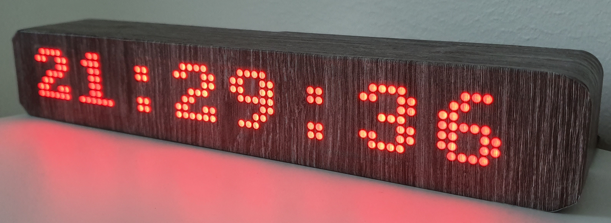

# Informer


<p align="center">
  
</p>

 The project provides a firmware for a smart informer built with ESP8288 and 8x8 LED matrixes.
The idea is to get various information provided by Home Assistant. All information is sent by mqtt messages. Configuration of the device can be done over mqtt messages as well.

The informer has a esp8266 (Wemos R1 mini board), 8 led matrixes, RTC built on DS1302 and a button to control some functions manually.
The led matrixes communicate with ESP8266 via SPI interface with MAX7219. Connection pins can be configured in the file `Config.h`


## Wiring

LED Matrixes (MAX7219)

| LED Matrixes |ESP8266|
|-----|-----|
| DIN | D7  |
| CS  | D8  |
| CLK | D5  |


The real time clock module:

| RTC |ESP8266|
|-----|-----|
| CLK |  D1 |
| DAT |  D2 |
| EN  |  D3 |

Button:

| Button |ESP8266|
|-----|-----|
| CLK |  D0 |


## Settings

 Configuration of the device can be done with MQTT messages.
The mqtt topic, where the informer receives settings messages, is `informer/set/setting`.

 Commands:
* Change brightness of the screen. The payload is a json document:

```json
{
  "brightness": 7
}
```
Brightness can take values between 0 and 10.

* Switch on/off the screen. The payload is a json document:

```json
{
  "state": "true"
}
```

* Switch on/off seconds while displaying time. The payload is a json document:

```json
{
  "secondsVisible": "true"
}
```

## Time

 Time in RTC can corrected via an mqtt message received to the topic `informer/set/time`. The payload is a json document:
 ```json
 {
   "year": 2019,
   "month": 6,
   "day": 22,
   "hour": 23,
   "minute": 28,
   "second": 14
 }
 ```
 All fields in the document are required.


 ## Notifications

 A quick message, received to the topic `informer/set/notification`, will be displayed for a certain period of time. Every notification message contains text and an icon. The icon must be 8x8 pixels and placed always at the left side:

 ```
 |X|_|_|_|_|_|_|_|
 ```

 X - represents an icon.
|_| - a matrix to display a text symbol. If the text is longer than 7 letters, it will be scrolled from right to left.

The payload of a notification message:
```json
{
  "icon": [ 23, 45, 54, 23, 67, 90, 0, 192 ],
  "text": "Awesome text",
  "timeout": 30
}
```

The `icon` is a json array contains 8 bytes which will be written into the first matrix. The `timeout` - number of seconds which define how long the message will be displayed. If the timeout is 0, a notification will be visible until the hard button is pressed.


## Screens
By pressing the button on the informer, a user can switch screens. By default time is always displayed. For example, Home Assistant can send a temperature as a screen to be displayed. Currently, screens get shown by pressing the hardware button on the informer. The mqtt topic, to receive a screen, is `informer/set/screen` The playload is similar to a notification, except that a screen must have an id.

```json
{
  "icon": [ 23, 45, 54, 23, 67, 90, 0, 192 ],
  "text": "Awesome text",
  "id": 30
}
```

If a message is received with the same `id`, it will update the existing screen in memory.

## Home Assistant configuration

Here is an example of automation in Home Assistant how to send a message to the Informer

```yaml
- alias: '[Informer] Notify sunset'
  hide_entity: true
  initial_state: true
  trigger:
  - platform: sun
    event: sunset
  action:
  - service: mqtt.publish
    data_template:
      topic: 'informer/set/notification'
      payload: "{'icon':[8,42,28,127,0,54,28,8], 'text': 'sunset', 'timeout':60}"
      retain: false
      qos: 0

```
Another example shows how to send a screen with outside temperature:

```yaml
- alias: '[Informer] Temperature outside'
  hide_entity: true
  initial_state: true
  trigger:
  - platform: time_pattern
    minutes: '/15'
    seconds: 0
  action:
  - service: mqtt.publish
    data_template:
      topic: 'informer/set/screen'
      payload: "{'icon':[228,166,239,6,6,22,12,0], 'text':'{{ states.sensor.temperature_outdoor.state | round(0) }}^', 'id':1}"
      retain: false
      qos: 0

```
It updates the outside temperature every 15 minutes.
